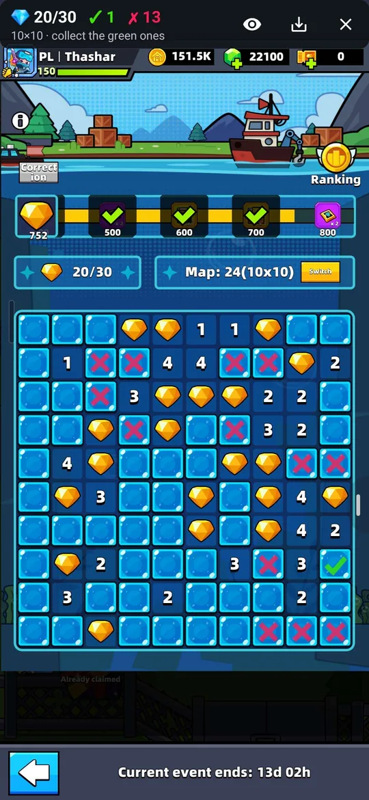

# Tidemyst Haven

Android overlay for the diamond board minigame. It reads the board from your screen
in real time and marks it for you:

- **green check** – a diamond is 100% here,
- **red X** – 100% no diamond here (safe to mark with X),
- **purple circle** – nothing is certain, this is the best guess.

A bar above the game counts collected diamonds, green checks and red X marks.
Boards 8×8 (20 diamonds), 10×10 (30) and 12×12 (45) are detected automatically,
on any screen resolution.

  

**[⬇ Download the latest APK](https://github.com/Thashar/tidemyst-haven/releases/latest/download/tidemyst-haven.apk)**
· [all versions](https://github.com/Thashar/tidemyst-haven/releases)

No Android? The web version works on iPhone and PC: **[haven.thashar.dev](https://haven.thashar.dev)**
(upload a screenshot or tap the board in yourself).

## Install

1. Download the APK on your phone and open it. Android 8.0 or newer.
2. If Android asks, allow installing apps from this source (browser or file manager).
3. Google Play Protect may warn that the app is unknown – it is not on Google Play,
   so this is expected. Tap **Install anyway**.

## Use

1. Open Tidemyst Haven and grant the permissions: **Overlay** and **Notifications**.
2. Tap **Start overlay** and when asked about screen recording choose **Entire screen**
   (Android asks every time) – this is how the app sees the board.
3. Open the diamond board in the game. The marks appear on their own.
4. Collect the green checks, put X on the red X cells, and when nothing is certain,
   go for the purple circle.

Drag the top bar up or down so it does not cover the board frame. The app has an
**Instructions** button and a PL / EN switch.

## Privacy

Everything happens on your phone. The app has **no internet permission**, so it
cannot send anything anywhere – screen capture is used only to read the board.

---

## Po polsku

Nakładka na Androida do minigry z diamentami. Na żywo czyta planszę z ekranu
i zaznacza: **zielony ptaszek** – tu na 100% jest diament, **czerwony X** – tu na
100% nie ma diamentu, **fioletowe kółko** – nic nie jest pewne, a to najlepszy
strzał. Sama rozpoznaje plansze 8×8, 10×10 i 12×12 w każdej rozdzielczości.

**[⬇ Pobierz najnowszy APK](https://github.com/Thashar/tidemyst-haven/releases/latest/download/tidemyst-haven.apk)**
· wersja przeglądarkowa (iPhone, komputer): **[haven.thashar.dev](https://haven.thashar.dev)**

1. Pobierz APK na telefon i otwórz go (Android 8.0 lub nowszy). Jeśli Android zapyta,
   zezwól na instalowanie aplikacji z tego źródła. Ostrzeżenie Play Protect jest
   normalne, bo aplikacji nie ma w Google Play – dotknij **Zainstaluj mimo to**.
2. W aplikacji nadaj uprawnienia **Nakładka** i **Powiadomienia**, dotknij
   **Uruchom nakładkę**, a przy pytaniu o nagrywanie ekranu wybierz **Cały ekran**.
3. Otwórz planszę z diamentami w grze – znaczniki pojawią się same.

Aplikacja nie ma uprawnienia do internetu – wszystko liczy się na telefonie
i nic nie jest nigdzie wysyłane.

---

Created by Thashar (Polski Squad)
